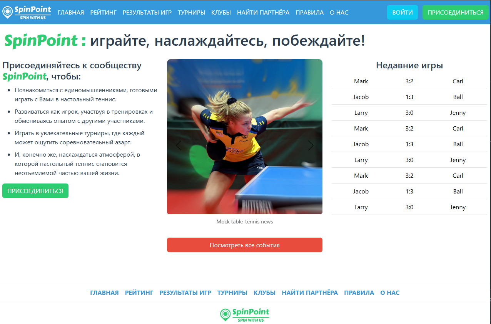
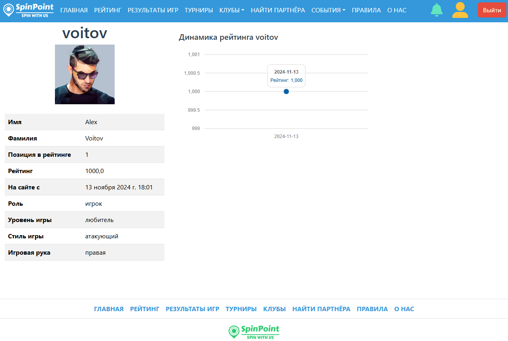
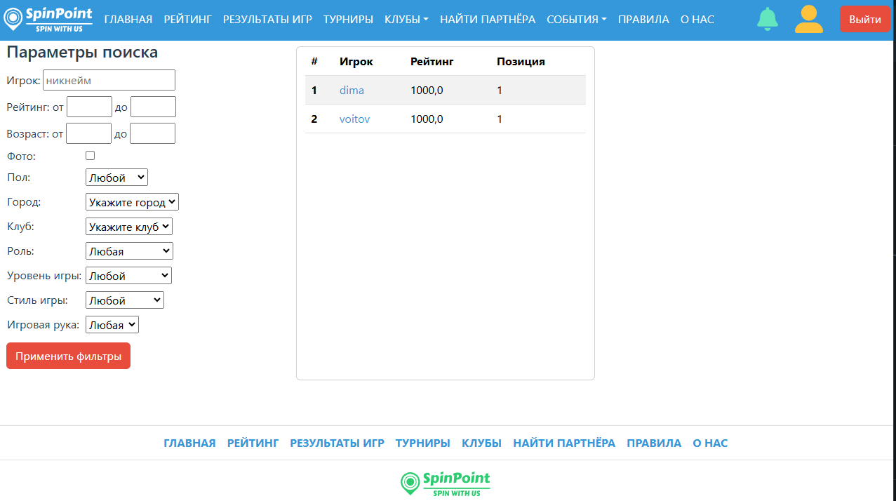
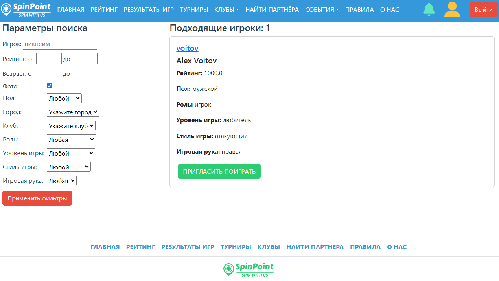
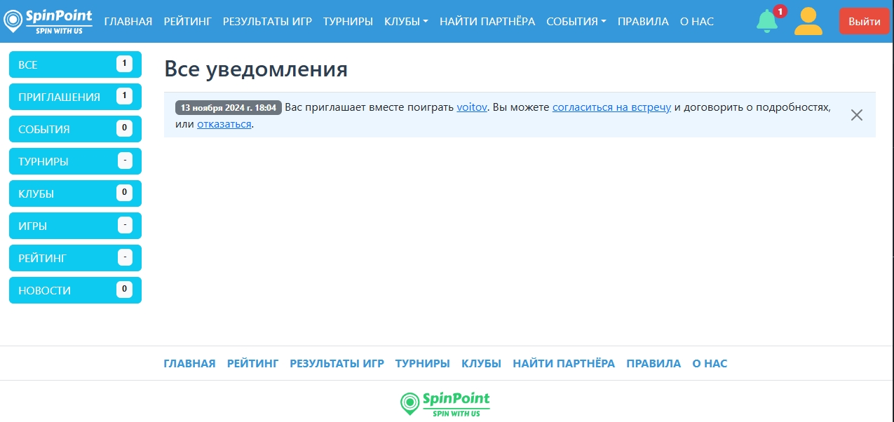
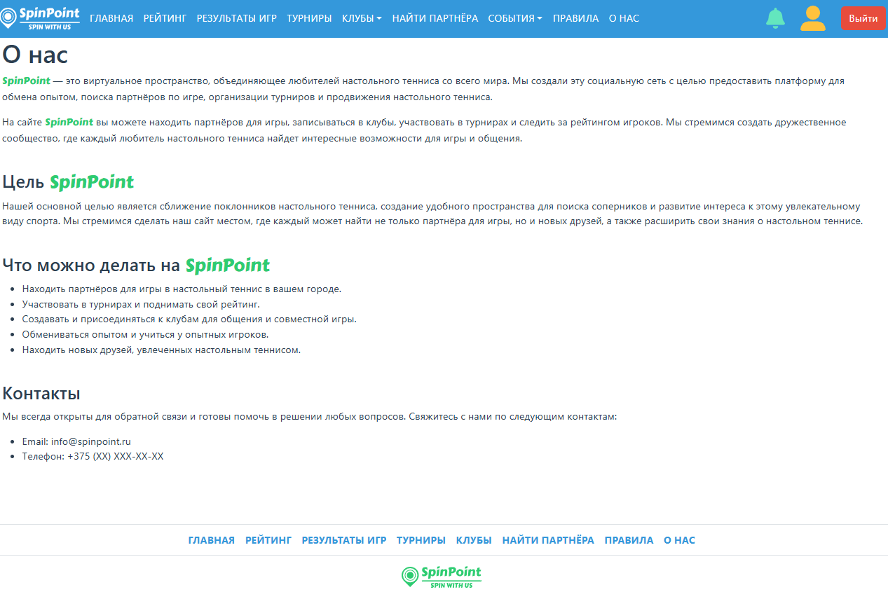

*SpinPoint* is the social network for table-tennis players.

**WARNING**: it is just concept. If you are also like table-tennis and would like to join to create
the project from the scratch using FastAPI and appropriate frontend, and Telegram as well,
please, don't be shy to contact me. I will add you to our small group of ambitient  people who very like programming and table-tennis :)

## Getting started

To see how the *SpinPoint* concept works follow the six simple steps:
1. Clone the repository:
```bash
git clone  https://github.com/DmitryYakimchuk/spin_point.git
```
2. Create `.env` with some environment variables in the root of the app. See the `.env.template` as an example one (You can just copy it if you like).
3. Use Docker compose to build the images for the app:
```bash
docker compose build
```
4. Run the app:
```bash
docker compose up app-dev
```
5. Open your browser and go to http://localhost:8000
6. To be able to see more functionality register in the app as a new user.

On the local site http://localhost:8000 you can register new users, make new club, news, find other users who want to play with you and so on...

## Used Technologies
* Django 4.2.9
* PostgreSQL 16
* Docker and docker compose
* Frontend: HTML + CSS + DTL + JavaScript

## Application screenshots

<br>

<br>

<br>

<br>

<br>
